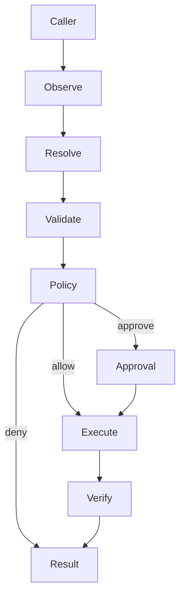
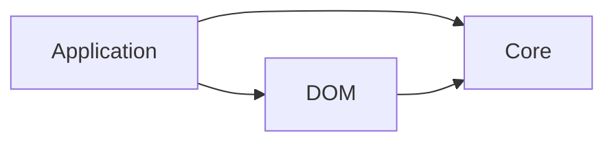

# Runtime architecture

## Control flow

The action proposal is the control boundary. It records target, input, expected effects, risk metadata, confidence, resolver provenance, and the observation version from which it was derived.

## Safety invariants

1. Execution always re-observes and validates current state.
2. A proposal cannot execute against a different observation version.
3. A target must be visible, enabled, present, and compatible with the action.
4. Intent effect constraints and configured policy run before every action.
5. Approval-required actions fail closed when no approval handler exists.
6. Execution and verification are distinct; evidence-free execution is not reported as verified success.
7. Multi-step execution is opt-in and limited by actions, resolutions, time, and cancellation.

## Package dependency direction

`@webpage-agent/core` has no dependency on a browser, model SDK, UI framework, agent framework, or protocol. `@webpage-agent/dom` implements browser-facing contracts from core.

## Current implementation boundary

The initial implementation covers RFC phases 0 and 1: contracts and a deterministic semantic runtime. The model resolver remains an application-supplied interface. A production model adapter should use schema-constrained output and must convert model output into an `ActionProposal`; it should never execute model-generated code.
